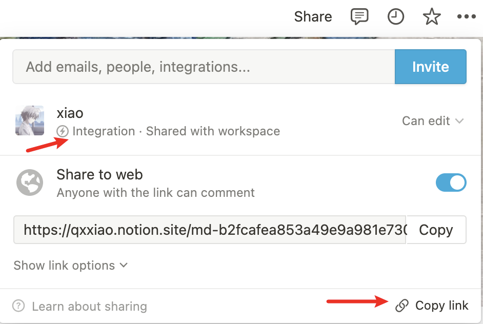

# notion2md
>  use offical notion api with [**notion_client**](https://github.com/ramnes/notion-sdk-py)    

Convert multiple notion pages to markdown files and try to keep the formatting usable.

## Usage

1. Get Internal Integration Token  
   In [https://www.notion.so/my-integrations](https://www.notion.so/my-integrations), create your workspace intergarions and get token, like `secret_...`


2. download notion_client:
```python
pip3 install notion-client
```

3. set env variable  
```shell
export NOTION_TOKEN=your token 
export NOTION_PAGES=your main page link
```
you can select a seperate open page for downloading, and put others page links in this page. Then get this page link:  
   
**make sure you add the interation to your workspace and all your pages your will export.**


4. download files
```python
python3 notion2md/exporter.py
```
pages are saved to notion2md_files dir, default only download files storaged in notion.
BTW using a single page notion app can also output all md files, which is actually enough to use.


## notes  
- only download files in notion, external links will be ignored.
- for database, only download pages in the database.
